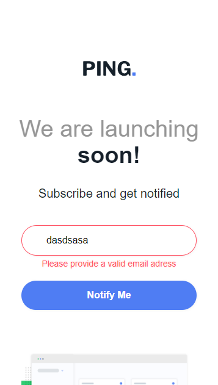

# Frontend Mentor - Ping coming soon page solution

### Screenshot





**Note: Delete this note and the paragraphs above when you add your screenshot. If you prefer not to add a screenshot, feel free to remove this entire section.**

### Links

- Solution URL: [](https://github.com/Wellissonb/ping-coming-soon-page)
- Live Site URL: [](https://wellissonb.github.io/ping-coming-soon-page/)

## My process

### Built with

- Semantic HTML5 markup
- CSS custom properties
- Flexbox
- Mobile-first workflow


### What I learned


```html
<h1>Nothing new</h1>
```
```css
.proud-of-this-css {
  /*Nothing new*/
}
```
```js
  const new = () => {
    console.log('Nothing new')
  }
```

